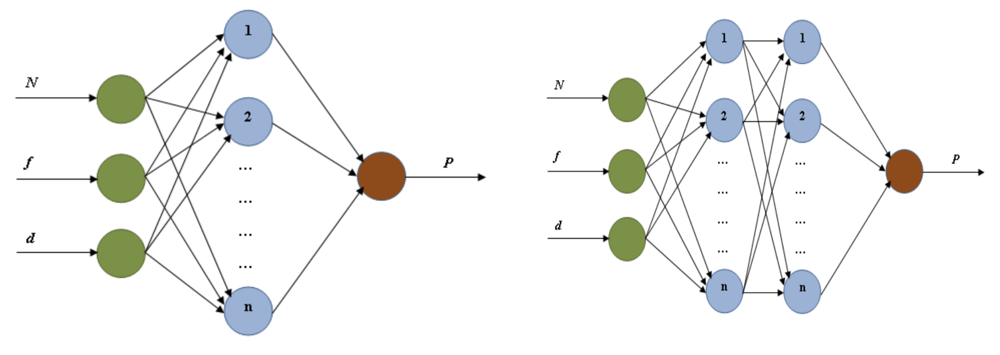
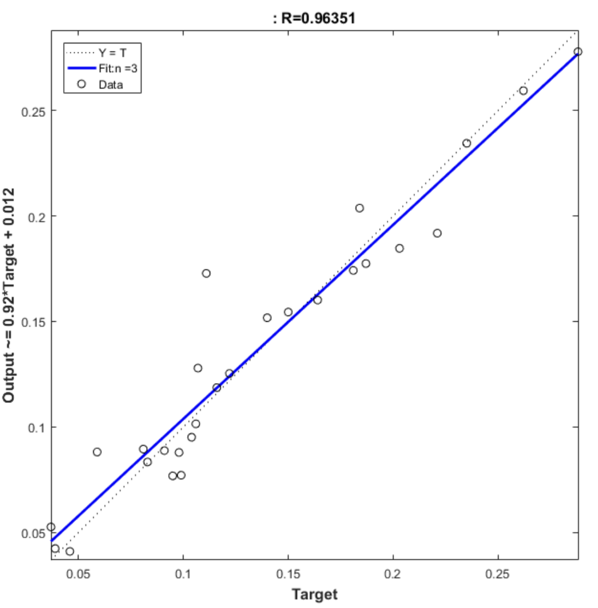
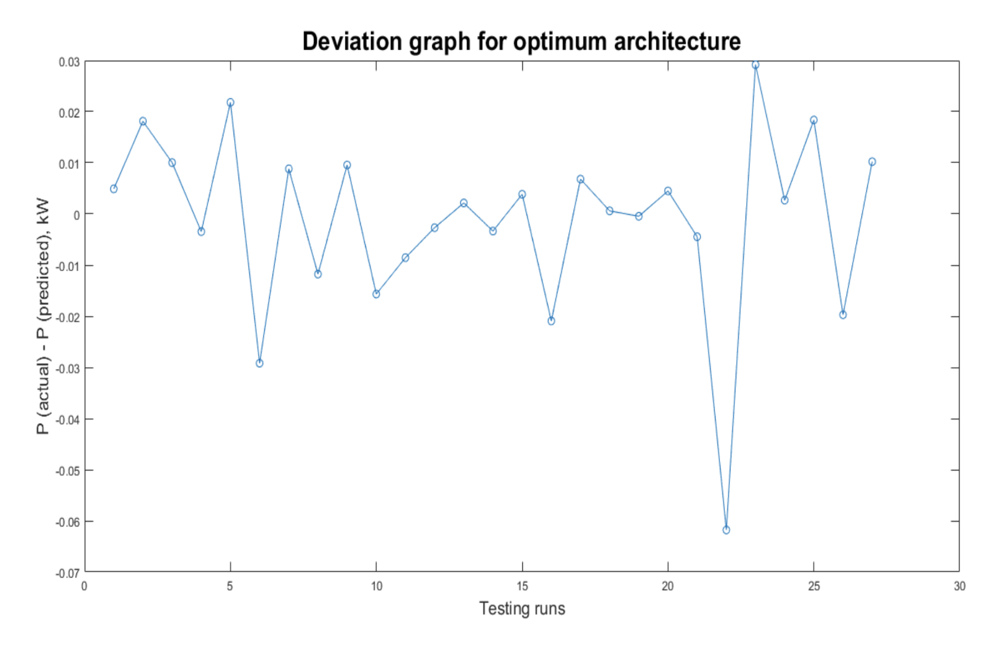
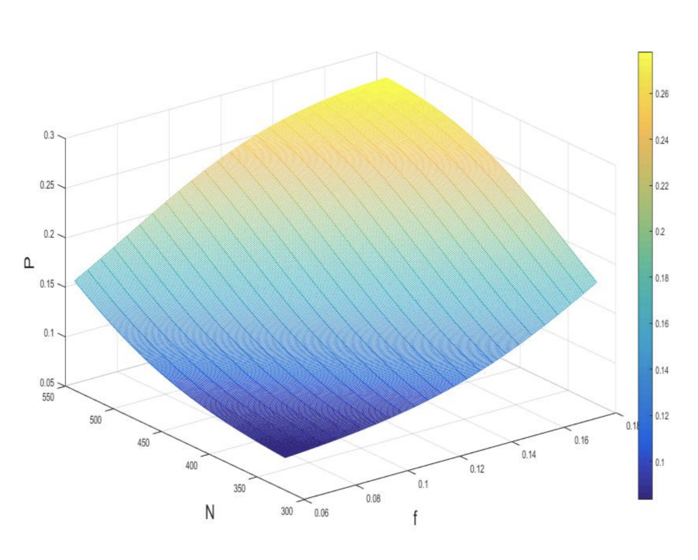
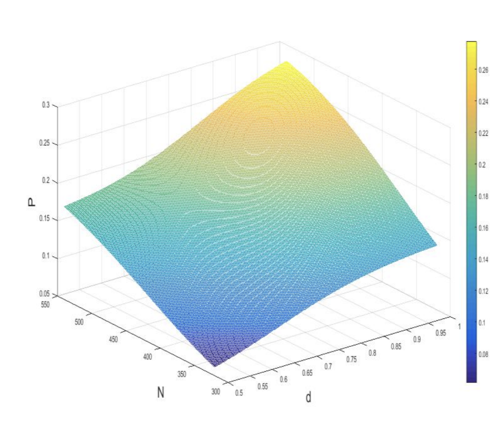
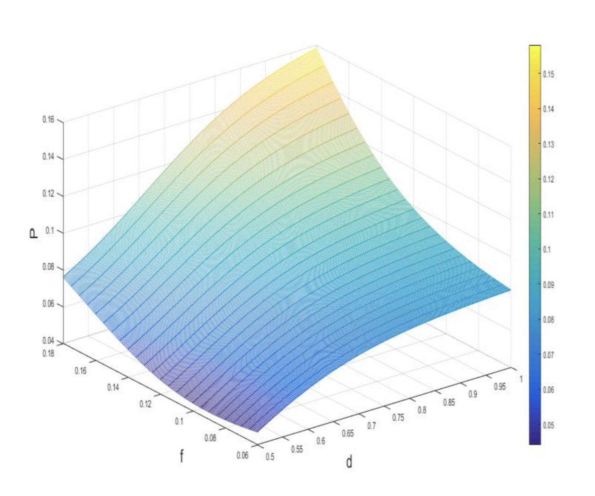

# Power consumption prediction using ANN Toolbox
The objective of this project is to predict power consumption during a machining process as a function of spindle speed in revolutions per minute (N), feed rate (f), and depth of cut (d). All combinations of 40 ANN configurations, 10 algorithms and 3 transfer functions to arrive at at the one that results in the least room mean square error (RMSE).

## Algorithms and Transfer functions taken into consideration
| Algorithms Name | MATLAB Function Name |
| --- | --- |
| Levenberg-Marquardt | trainlm |
| Bayesian Regularization Backpropagation | trainbr |
| Scaled Conjugate Gradient | trainscg |
| BFGS Quasi-Newton | trainbfg |
| Resilient Backpropagation | trainrp |
| Conjugate Gradient with Powell/Beale Restarts | traincgb |
| Fletcher-Powell Conjugate Gradient | traincgf |
| Polak-Ribiere Conjugate Gradient | traincgp |
| One Step Secant | trainoss |
| Variable Learning Rate Backpropagation | traingdx |

| Transfer Function Name | MATLAB Function Name |
| --- | --- |
| Pure Linear | purelin |
| Hyperbolic Tangent Sigmoid | tansig |
| Log-Sigmoid | logsig |

## ANN Configurations
Choosing an appropriate ANN architecture, algorithm and transfer function is a difficult task as
the best performing configuration might be different for different types of datasets, hence, training and testing all possible ANN configurations for the lowest RMSE with training and testing data is the best way to find the ANN configuration giving the best performance. Arbitrarily choosing an ANN
architecture might lead to over-fitting or under-fitting. Over-fitting of the training dataset occurs if the number of hidden layer neurons is too high, this compromises the adaptability of the model to new experimental data. Under-fitting occurs when the number of hidden layer neurons is too low; in this case, the model will fail to fit the training data leading to higher prediction error. In this study, a feed-forward neural network has been used with each ANN configuration that has been tested for the lowest RMSE. In this work, two types of architectures have been explored for prediction of power consumption – 3-n-1 and 3-n-n-2. Since there is no hard and fast rule for choosing the number of hidden neurons, the value of n has been varied from 1 to 20 for each architecture type and each of these 40 architectures has been trained using every combination of 10 algorithms and 3 hidden layer transfer functions.

## Training
MATLAB Neural Network Toolbox was used to train the ANNs. 70% of the experimental dataset was
used as training dataset, 15% as testing dataset and 15% as validation dataset. Each algorithm-transfer
function combination was then applied to each of the 40 architectures and the best performing
architecture was found for each algorithm-transfer function combination. The best performing ANN
configuration was then found by comparing RMSE of the architectures obtained in the previous step.

## Results
After testing each algorithm-transfer function combination with all architectures, the architecture 3-3-3-1 with Log-Sigmoid as the hidden layer transfer function and trained with Bayesian Regularization
Backpropagation resulted in the lowest RMSE of 0.017 and a correlation coefficient of 0.963. The correlation coefficient is a measure of how well the model has been able to fit the training data. The figure below shows the regression plot generated after training of the 3-3-3-1 model. The predicted values of power consumption are appreciably close to the observed values. The deviation graph shows the error between predicted and observed values of power consumption.

The graphs below show how Power varies vs. N & f, N & d and f & d respectively using the most optimal model.

